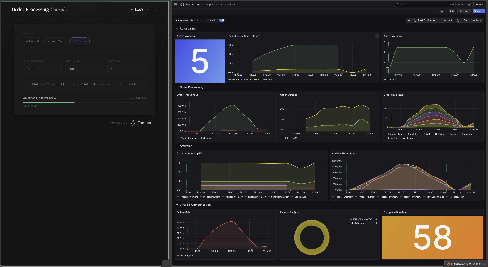
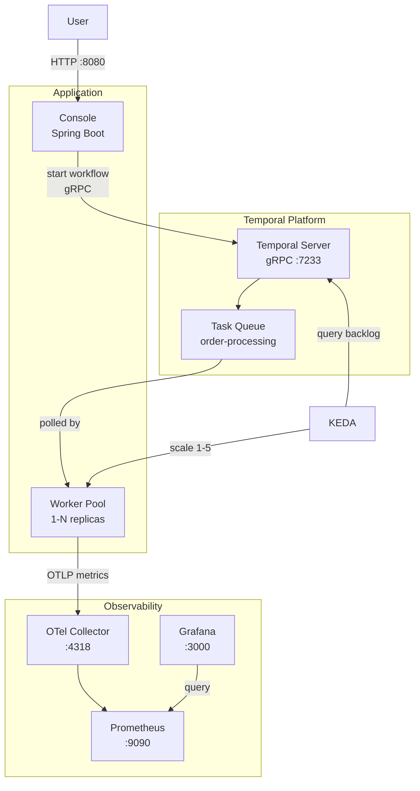
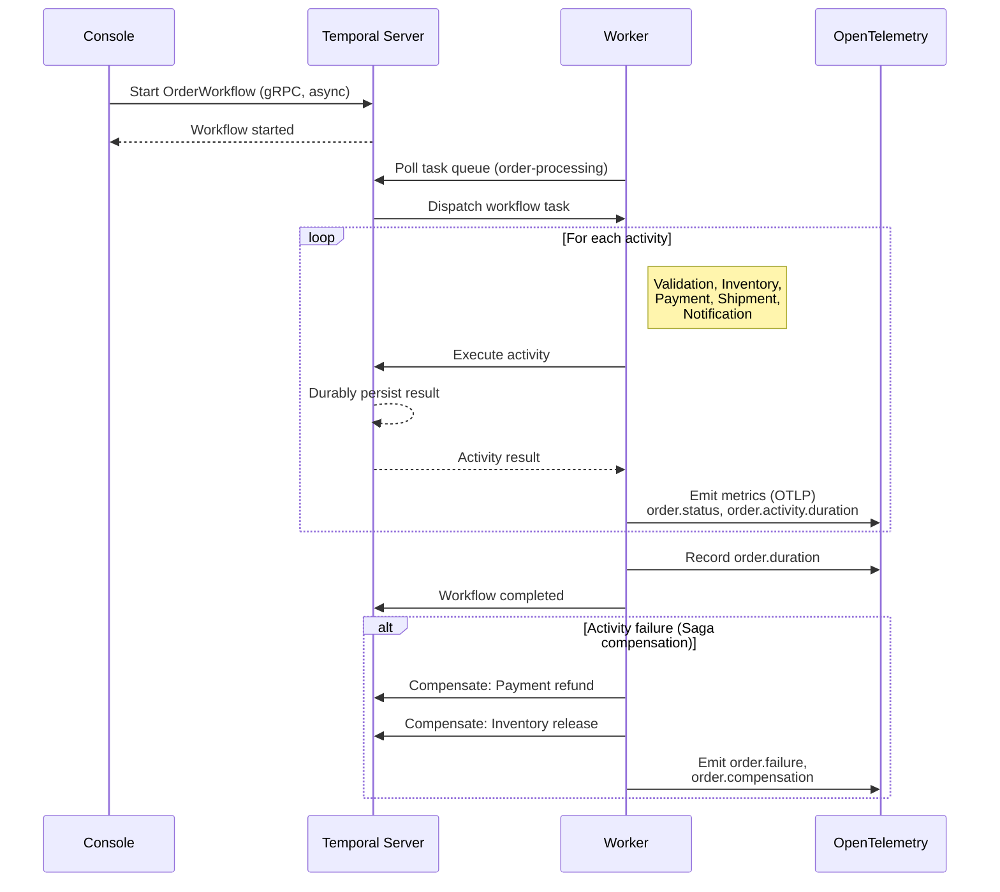

# Temporal Autoscaling Demo

## The Problem: Scaling Stateful Workflows Is Hard

Traditional workflow engines tie execution state to the
process running it. When that process crashes, scales down,
or restarts during a deployment, in-flight work is lost.
Teams compensate with custom checkpointing, idempotency
layers, and recovery logic -- adding complexity that has
nothing to do with the business problem they are solving.

Autoscaling makes this worse. Scaling workers down under
load means killing processes that may hold uncommitted
state. Scaling up means new workers must somehow discover
and resume orphaned work. Most systems force you to choose
between elasticity and reliability.

## How Temporal Solves It

https://github.com/user-attachments/assets/9f6c2576-bcbc-40ac-b9fb-fce80585001c

[Temporal](https://temporal.io) decouples workflow state
from the workers that execute it. The Temporal Server
durably persists every state transition, so workers are
**stateless and disposable**. This unlocks a set of
properties that are difficult to achieve any other way:

- **Durable Execution** -- Workflow progress is persisted
  by the Temporal Server, not the worker. A worker can
  crash, restart, or be terminated at any point, and the
  workflow resumes exactly where it left off on another
  worker. No data loss, no custom recovery code.

- **Elastic scaling without risk** -- Workers can scale
  from zero to hundreds and back again. KEDA (or any
  autoscaler) can freely add or remove worker pods based
  on task-queue backlog. In-flight workflows are never
  affected because state lives in the server, not the
  worker.

- **Automatic retries with backoff** -- Transient
  failures (network timeouts, downstream outages) are
  retried automatically according to configurable
  policies. Activities retry transparently; the
  workflow author writes only the happy path.

- **Saga pattern for compensations** -- When a
  multi-step workflow fails partway through (e.g. payment
  succeeds but shipment fails), Temporal orchestrates
  compensating actions to roll back completed steps.
  The compensation logic is expressed directly in
  code -- no external state machines or coordination
  tables.

- **Full visibility into workflow state** -- Every
  workflow execution is inspectable: current status,
  complete event history, pending activities, and
  query handlers. Debugging a stuck order means opening
  the Temporal UI, not grepping through logs.

## What This Demo Shows

This project demonstrates these properties with a
realistic **order-processing workflow** that runs
through validation, inventory, payment, shipment, and
notification activities. A web console lets you launch
configurable load scenarios and watch Temporal handle
them -- even as workers scale up, scale down, or
restart mid-flight.

The demo includes a full observability stack
(Prometheus + Grafana) so you can see autoscaling
decisions, workflow throughput, activity durations,
error rates, and Saga compensations in real time.



## Architecture

The following diagram shows how the components
interact:



The sequence below illustrates a typical order
workflow execution:



| Component | Stack | Purpose |
|-----------|-------|---------|
| **`worker/`** | Java 25, Spring Boot 4, Temporal SDK | Hosts the `OrderWorkflow` and its activities (payment, inventory, shipment, validation, notification) |
| **`console/`** | Java 25, Spring Boot 4, Thymeleaf | Web UI to trigger workflows with pre-defined load scenarios |

Both components expose metrics in **OpenTelemetry**
format, visualized through a Grafana dashboard.

## Prerequisites

- Java 25+
- [Temporal CLI](https://docs.temporal.io/cli)
  (`temporal`)
- Docker & Docker Compose (for containerized setup)

## Quick Start

### Local (bare-metal)

Start a local Temporal dev server, then run the worker
and console in separate terminals:

```bash
# Terminal 1
temporal server start-dev

# Terminal 2
cd worker && ./mvnw spring-boot:run

# Terminal 3
cd console && ./mvnw spring-boot:run
```

- **Console**: http://localhost:8080
- **Temporal UI**: http://localhost:8233

### Docker Compose

```bash
docker compose up --build
```

This starts Temporal, the worker (3 replicas), the
console, and a full observability stack
(Prometheus + Grafana).

| Service | URL |
|---------|-----|
| Console | http://localhost:8080 |
| Temporal UI | http://localhost:8233 |
| Prometheus | http://localhost:9090 |
| Grafana | http://localhost:3000 |

Grafana is pre-configured with anonymous access (no
login required). Workers push metrics to Prometheus
via its built-in OpenTelemetry (OTLP) receiver -- no
additional agent or scrape config is needed.

See [Grafana dashboard](#grafana-dashboard) below for
panel details.

## Kubernetes (Integration Environment)

The integration environment runs on a local Kubernetes
cluster provisioned by
[temporal-k8s](https://github.com/alexandreroman/temporal-k8s).
This project deploys Temporal alongside **Grafana** for
metrics visualization and **KEDA** for autoscaling
workers based on Temporal task-queue backlog.

Once the cluster is up, use the `it` Spring profile
to connect:

```bash
# Terminal 1
cd worker && ./mvnw spring-boot:run -Dspring-boot.run.profiles=it

# Terminal 2
cd console && ./mvnw spring-boot:run -Dspring-boot.run.profiles=it
```

| Service | URL |
|---------|-----|
| Temporal UI | http://temporal.127-0-0-1.nip.io |
| Temporal API | `temporal.127-0-0-1.nip.io:7233` |
| OTel Collector | http://otel.127-0-0-1.nip.io:4318 |
| Grafana | http://grafana.127-0-0-1.nip.io |
| Prometheus | http://prometheus.127-0-0-1.nip.io |

### Kubernetes Deployment

Deploy and manage the application on Kubernetes using
[Task](https://taskfile.dev):

```bash
task app-deploy   # Deploy to Kubernetes
task app-delete   # Delete the deployment
```

`app-deploy` picks the best available toolchain:
**kapp + kbld**, **kapp** alone, or plain **kubectl**.
Both tasks require `kustomize`.

The [Grafana dashboard](#grafana-dashboard) is deployed
alongside the application as a ConfigMap picked up by
the Grafana sidecar.

## Grafana Dashboard

Both Docker Compose and Kubernetes environments ship
a pre-built **Temporal Autoscaling Demo** dashboard
(under **Dashboards > Temporal Autoscaling Demo**).
It covers:

- **Autoscaling indicators**: active workers,
  schedule-to-start latency, worker task slots
- **Order processing**: throughput, duration
  percentiles, status breakdown
- **Activity performance**: duration and throughput
  per activity type
- **Errors & compensation**: failure rate, error type
  distribution, Saga compensations

## Debugging

Inspect workflows via the Temporal CLI:

```bash
temporal workflow show   -w <workflow-id>
temporal workflow query  -w <workflow-id> --type <query-type>
temporal workflow signal -w <workflow-id> --name <signal-name>
temporal workflow stack  -w <workflow-id>
```

## License

[Apache License 2.0](LICENSE)
